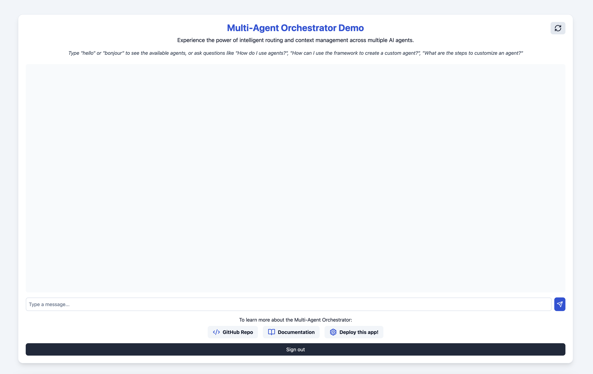

## 🎮 Demo Application

### Overview
The demo showcases the versatility of the Multi-Agent Orchestrator System through an interactive chat interface.



### Featured Agents
Our demo showcases specialized agents, each designed for specific use cases:

| Agent | Technology | Purpose |
|-------|------------|---------|
| Business Analyst Agent | Bedrock LLM | Uses the stakeholder’s business requirement to generate the foundational documentation (including business goals, functional and non-functional requirements, and draft user stories) that will form the basis for the BRD and FSD.|
| Product Owner Agent | Bedrock LLM | Converts the business requirement into detailed sprint backlog items that are refined, prioritized, and include all necessary details (title, description, acceptance criteria, dependencies, estimated effort, potential blockers, and suggested priority). |
| Project Manager Agent | Bedrock LLM | Develops a comprehensive sprint plan and status report from the business requirement, outlining sprint objectives, deliverables, progress metrics, risk summary, and upcoming milestones, ensuring that the sprint is well-planned and monitored. |
| **Tech Agent** | Bedrock LLM + Knowledge Base | Offers technical support and documentation assistance with direct access to **Multi-Agent Orchestrator framework source code** |

The demo highlights the system's ability to handle complex, multi-turn conversations while preserving context and leveraging specialized agents across various domains.

### Key Capabilities
- **Context Switching**: Seamlessly handles transitions between different topics
- **Multi-turn Conversations**: Maintains context across multiple interactions
- **Tool Integration**: Demonstrates API and custom tool usage
- **Agent Selection**: Shows intelligent routing to specialized agents
- **Follow-up Handling**: Processes brief follow-up queries with context retention

## 📋 Prerequisites

Before deploying the demo web app, ensure you have the following:

1. An AWS account with appropriate permissions
2. AWS CLI installed and configured with your credentials
3. Node.js and npm installed on your local machine
4. AWS CDK CLI installed (`npm install -g aws-cdk`)

## 🚀 Deployment Steps

Follow these steps to deploy the demo chat web application:

1. **Clone the Repository**:
   ```bash
   git clone https://github.com/michaelnguyen11/multi-agent-chat-demo.git
   cd multi-agent-chat-demo
   ```

2. **Install Dependencies**:
   ```bash
   npm install
   ```

3. **Bootstrap AWS CDK**:
   ```bash
   cdk bootstrap
   ```

4. **Review and Customize the Stack** (optional):
   Open `cdk.json` and review the configuration. You can customize aspects of the deployment by enabling or disabling additional agents.

5. **Deploy the Application**:
   ```bash
   cdk deploy --all
   ```

6. **Create a user in Amazon Cognito user pool**:
   ```bash
   aws cognito-idp admin-create-user \
       --user-pool-id your-region_xxxxxxx  \
       --username your@email.com \
       --user-attributes Name=email,Value=your@email.com \
       --temporary-password "MyChallengingPassword" \
       --message-action SUPPRESS \
       --region your-region
   ```

## 🌐 Accessing the Demo

Once deployment is complete:
1. Open the URL provided in the CDK outputs in your web browser
2. Log in with the created credentials
3. Start interacting with the multi-agent system

## ✅ Testing the Deployment

To ensure the deployment was successful:

1. Open the web app URL in your browser
2. Try different types of queries:
   - Business Analyst questions
   - Product Owner questions
   - Project Manager questions
   - Technical questions
3. Test follow-up questions to see context retention
4. Observe agent switching for different topics

## 🧹 Cleaning Up

To avoid incurring unnecessary AWS charges:
```bash
cdk destroy
```

## 🛠️ Troubleshooting

If you encounter issues during deployment:

1. Ensure your AWS credentials are correctly configured
2. Check that you have the necessary permissions in your AWS account
3. Verify that all dependencies are correctly installed
4. Review the AWS CloudFormation console for detailed error messages if the deployment fails

## ➡️ Next Steps

After exploring the demo:
1. Customize the web interface in the source code
2. Modify agent configurations to test different scenarios
3. Integrate additional AWS services
4. Develop custom agent implementations

## ⚠️ Disclaimer

This demo application is intended solely for demonstration purposes. It is not designed for handling, storing, or processing any kind of Personally Identifiable Information (PII) or personal data. Users are strongly advised not to enter, upload, or use any PII or personal data within this application. Any use of PII or personal data is at the user's own risk and the developers of this application shall not be held responsible for any data breaches, misuse, or any other related issues. Please ensure that all data used in this demo is non-sensitive and anonymized.

For production usage, it is crucial to implement proper security measures to protect PII and personal data. This includes obtaining proper permissions from users, utilizing encryption for data both in transit and at rest, and adhering to industry standards and regulations to maximize security. Failure to do so may result in data breaches and other serious security issues.